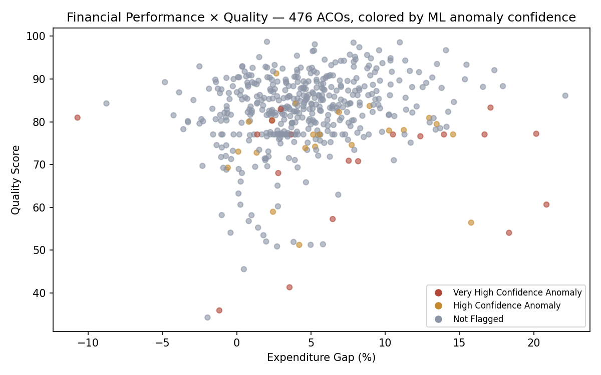
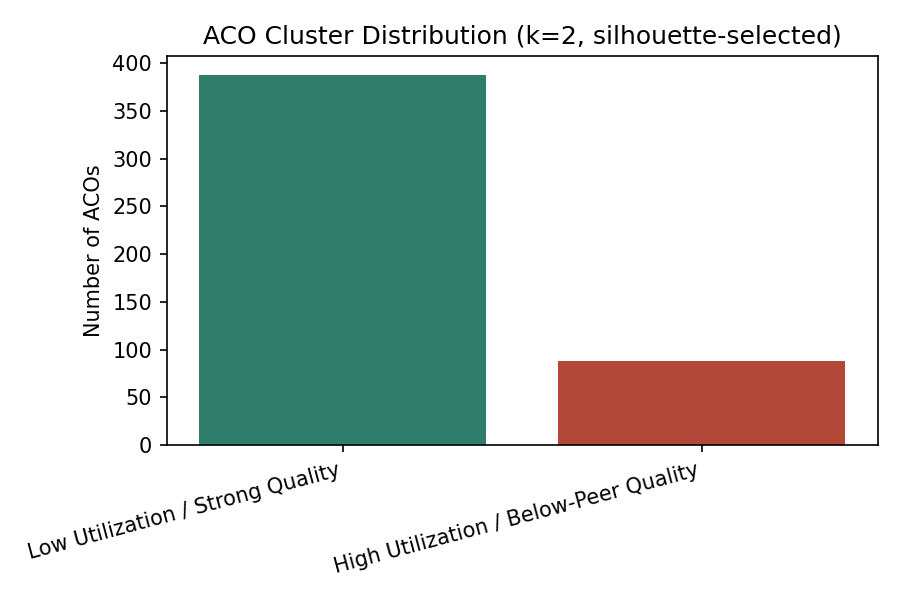
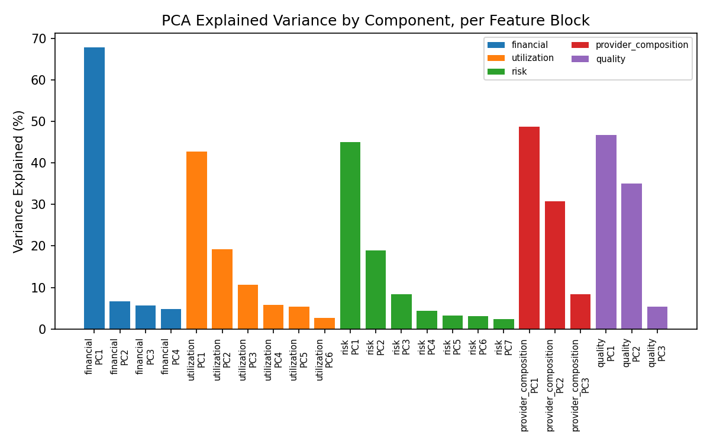

# Value-Based Care Payer Contract Performance Command Center
## Written Report

---

## 1. Problem & Approach

Payers increasingly pay providers for value, not volume. This project builds a payer-facing
command center that tracks an ACO's cost, quality, and utilization performance; identifies
what's driving savings or losses; flags anomalous contracts; and recommends specific review
actions — culminating in a printable provider-review meeting brief.

Per the governing constraint of this project, CMS's own benchmark and attribution methodology is
never reconstructed. Published financial and quality results are taken at face value; the effort
goes into the scorecard, the machine learning layer that surfaces patterns a static dashboard
can't, and the narrative that makes those patterns usable in a real meeting.

## 2. Data

Three CMS public-use datasets, at three different grains, deliberately never fused together:

| Dataset | Grain | Role |
|---|---|---|
| MSSP Performance Year Financial & Quality Results | ACO × Performance Year (476 rows, 189 cols) | Primary — full ML pipeline |
| Medicare Physician & Other Practitioners by Provider/Service | NPI × HCPCS × Place of Service (national, multi-million row) | Enrichment — national context only |
| Hospital VBP Safety | Hospital × Fiscal Year (2,455 rows, 58 cols) | Enrichment — national context only |

No provider-to-ACO or hospital-to-ACO attribution mapping was found or fabricated. Provider and
hospital findings are surfaced as general context in the review brief, explicitly labeled as not
attributed to the specific ACO being reviewed.

## 3. Data Quality Findings

The raw MSSP file uses CMS privacy-suppression sentinel codes (`*` for small-cell suppression,
`-` for structurally not-applicable fields) inside what pandas initially reads as plain text
columns — 83 of 189 columns were affected. These were converted to true missing values (with
missingness indicators) or 0 + an applicability flag, as appropriate, rather than left as text or
blindly zero-filled.

Three groups of quality-measure columns (`QualityID_134/001/236`, each with 4 reporting-method
variants: WI, eCQM, MIPSCQM, MedicareCQM) turned out to be mutually exclusive per ACO — 468 of 476
ACOs report via exactly one method. These were coalesced into a single value plus a method tag
rather than treated as four separate sparse features.

Two real bugs were found and fixed during the hospital data pipeline: a missingness-flag
substring-match bug that silently corrupted safety-score averages, and a text-format parsing gap
(`Achievement Points`/`Improvement Points` use the same `"X out of 10"` format as `Measure Score`
but were initially parsed as plain numerics, silently NaN'ing every value). Both are documented in
the pipeline code and the notebook, not hidden.

## 4. Machine Learning Approach

**Why not supervised prediction of savings/loss:** with 476 ACO records, a supervised model
predicting the financial outcome would face severe overfitting risk and produce results that are
difficult to interpret causally. This is deliberately not built as the primary ML contribution —
documented as a legitimate future phase if multi-year longitudinal data becomes available.

**What was built instead**, applied identically across all three data grains (ACO, Provider,
Hospital):

1. **PCA** — 189 raw ACO columns grouped into 5 domain-meaningful feature blocks (Financial,
   Utilization, Population/Risk, Provider Composition, Quality), scaled with `RobustScaler`
   (chosen for resilience to healthcare utilization's characteristic outliers), then reduced to
   ~85% cumulative explained variance per block. A guard rail falls back to raw features if a
   block's first component is too weak to interpret — not triggered on this data (weakest block
   was Utilization at 42.8% PC1 variance, still well above the 40% threshold).
2. **KMeans clustering** — tested K=2 through 8 with silhouette score, Davies-Bouldin score, and
   seed-to-seed stability (Adjusted Rand Index). K=2 won decisively: best silhouette (0.496),
   perfectly stable, genuinely interpretable. Higher K values began isolating 2-member clusters
   that are statistically outliers, not real segments — that is anomaly detection's job.
3. **Isolation Forest anomaly detection** — contamination swept at 5/10/15%, with a mandatory
   10-seed stability check; only ACOs flagged in ≥80% of reruns are treated as high-confidence.
   Every flagged entity is explained via plain-language peer-percentile deviation, cross-checked
   against a secondary decision-tree feature-importance analysis — never a bare anomaly score.
4. **Driver, opportunity, and recommendation engines** — a weighted composite score (config-driven
   weights, never hardcoded) combines raw deviation, PCA strength, anomaly strength, financial and
   quality relevance, and confidence into a ranked driver list per ACO. A sensitivity check
   confirmed 88.7-91.4% top-driver agreement across two meaningfully different alternate weight
   sets — the score is stable, not fragile opinion dressed as precision. Final recommendations are
   fully deterministic rule-based logic (never LLM-generated), by deliberate design: this keeps
   every recommendation traceable to specific evidence.

## 5. Key Findings

**Figure 1** below shows the full portfolio: expenditure gap (%) on the x-axis, quality score on
the y-axis, colored by ML anomaly confidence. Flagged ACOs (red/gold) visibly cluster toward lower
quality scores.

- **460 of 476 ACOs (97%) recorded savings** this performance year — the portfolio is heavily
  skewed toward savings, which shapes how "top opportunities" should be read: they tend to be
  currently-profitable ACOs with unusual utilization patterns worth watching proactively, not
  currently-failing contracts.
- **K=2 clustering** cleanly separated an 88-ACO (18.5%) "High Utilization / Below-Peer Quality"
  segment from the 388-ACO mainstream — that segment shows +23% ED visits, +93% SNF admissions,
  and a 14-point quality gap. Notably, savings *rates* were nearly identical between clusters
  (97% vs 95%) — utilization and quality patterns did not map directly onto financial outcome
  here, plausibly because CMS's benchmark is already risk-adjusted.

- **19 ACOs flagged as very-high-confidence anomalies**, 22 more at high confidence — nested
  cleanly across contamination thresholds (5/10/15% produced perfectly nested sets), a strong
  internal-consistency signal.
- **Financial variance is dominated by a single axis** (68% of variance in the Financial block):
  Aged/Non-Dual per-capita cost level, consistent across all three benchmark years.

- **Hospital safety anomalies are genuinely bidirectional** — of 219 flagged facilities, 117 show
  unusually strong safety scores and 102 show unusually weak ones. This is concrete evidence for
  (not just a stated caveat about) the principle that "anomaly does not mean poor performance."

## 6. Product

A full-stack web application: FastAPI backend serving the precomputed analytical artifacts, React
+ TypeScript frontend with 8 pages (Command Center, ACO Detail with tabbed
Financial/Utilization/ML Profile/Drivers views, Provider Variation, Hospital Quality,
Opportunities, printable Review Brief, and a Methodology/Limitations reference page). Composite
scores always display their full weighted breakdown, never a bare number. ML-derived labels carry
a visually distinct badge so they're never confused with official CMS fields.

The Review Brief's narrative section is generated by an LLM strictly after all ML and analytics
are complete, fed only a structured evidence JSON (never raw data), with a mandatory post-hoc
validator that checks every number in the generated text against the evidence JSON and rejects any
narrative containing fabricated figures or ACO-provider attribution language the evidence doesn't
support. When no LLM is configured, the application degrades gracefully to structured-data-only
display rather than failing.

## 7. Limitations

See `docs/architecture.md` Section 23 for the complete list (16 items). The most consequential:

- ML identifies statistical patterns, not causality
- Clusters and anomaly labels are application-generated interpretations, not CMS classifications
- No verified ACO-provider or ACO-hospital attribution exists — those layers are shown as national
  context only, never fused into a specific ACO's story
- Single performance year of data — no true multi-year trend component
- Composite scores (Contract Health, ML Risk) are application-defined and unvalidated against any
  ground truth beyond the weight-sensitivity check
- The provider ML pipeline is proven correct on a 50-NPI synthetic sample matching the real CMS
  schema exactly — the real national physician file was not available during this build; the
  pipeline runs unchanged once it is supplied

## 8. Testing

29 automated tests across 5 categories — unit tests on hand-computed financial calculations,
ML regression tests using a synthetic dataset with a designed-in known outlier (verifying the
pipeline actually recovers ground truth, not just runs without error), API integration tests,
recommendation-rule trigger/non-trigger tests, and LLM output-validator tests (including a
regression test for a real bug found during development). All 29 pass.

---

*Full architecture specification: `docs/architecture.md`. Full analytical workflow with narration:
`notebooks/analysis.ipynb`. Setup and run instructions: `README.md`.*
